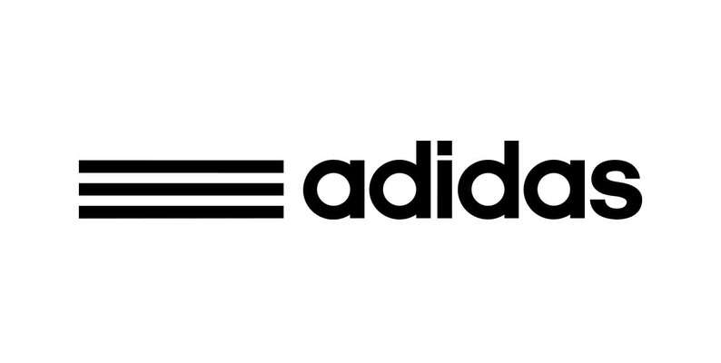

# Análisis de Ventas de Adidas en Estados Unidos

    

Este repositorio sirve como mi documentación para el Proyecto de análisis de datos exploratorios de ventas de Adidas en Estados Unidos.

Todo el proyecto se implementó utilizando Python 3 en Jupyter Notebook, SQL Server y Microsoft Power BI Desktop y se publicó en Microsoft Power BI Service.

## Contenido

<!-- - [Enlace al dataset en Kaggle](https://www.kaggle.com/datasets/heemalichaudhari/adidas-sales-dataset) -->
- [Enlace al dataset de Kaggle](https://www.kaggle.com/datasets/sagarmorework/adidas-us-sales)
- [Objetivo del Proyecto](#objetivo-del-proyecto)
- [Preguntas Clave](#preguntas-clave)
- [Herramientas Utilizadas](#herramientas-utilizadas)
- [EDA SQL y Python](#eda-sql-y-python)
- [Visualización de Datos](#visualización-de-datos)
- [Respuestas a Preguntas Clave](#respuestas-a-preguntas-clave)

## Objetivo del proyecto

El objetivo principal de este análisis es comprender mejor el rendimiento de las ventas, el comportamiento del cliente, la popularidad de los productos, las tendencias geográficas, los patrones estacionales y la rentabilidad de los productos Adidas. Mediante el uso de SQL y Python para la manipulación de datos y Power BI para su visualización.

## Preguntas Clave

Durante el análisis, busqué respuestas a las siguientes preguntas:

#### Análisis de ventas

- ¿Cuáles son los ingresos totales generados por año? (SQL)
- ¿Cuáles son los ingresos totales generados por mes tanto para los años 2020 y 2021? (SQL)
- ¿Cuáles son los 5 mejores productos a lo largo de los años? (SQL)
- ¿Cuál es el valor promedio de ventas diarias por minorista? (SQL)
- ¿Cuál es el período de máximas ventas? (Power BI)

#### Análisis del cliente

- ¿Cuáles son las principales regiones, estados y ciudades en términos de ventas? (SQL)
- ¿Cuáles son los 3 mejores métodos de venta? (SQL)

#### Análisis de Producto

- ¿Qué categorías de productos son las más populares (ropa/calzado) (SQL)
- ¿Es más popular el producto para hombres o para mujeres? (SQL)
- ¿Cuáles son los productos pedidos anualmente? (SQL)
- ¿Cuáles son los productos más vendidos? (Power BI)
- ¿Cuál es la preferencia de productos por género (Power BI)
- ¿Qué productos son más rentables? (Power BI)

#### Análisis geográfico

- ¿Cuáles son los mercados clave por región, estado y ciudad? (Power BI)
- ¿Cuáles son las regiones/estados/ciudades con mayores ventas? (Power BI)
- ¿Están mostrando crecimiento los mercados emergentes? (Power BI)

#### Análisis estacional

- ¿Existen tendencias estacionales en las ventas relacionadas con festividades o días festivos? (Power BI)

#### Análisis de rentabilidad

- ¿Cuál es el margen de beneficio para diferentes productos o categorías? (SQL)
- ¿Cómo varía la rentabilidad según los diferentes métodos de venta? (SQL)
- ¿Cuáles son los productos, métodos de venta o regiones más rentables? (Power BI)
- ¿Qué tan eficientes son canales de venta? (Power BI)
- ¿Hay productos con ventas altas pero márgenes bajos? (Power BI)

## Herramientas utilizadas

Las herramientas que utilicé son:

- SQL y Python para la manipulación y exploración de los datos.
- Power BI para la visualización de los datos.

## Limpieza | Data Cleaning (Python y SQL)

[Notebook Data Cleaning - Python](./notebooks/Data_Cleaning_Python.ipynb) - El notebook guarda un archivo csv limpio pero solo es para mostrar habilidades en python.

[Archivo Data Cleaning - SQL](./sql/Data_Cleaning.sql) - Se le da uso durante el análisis.

## EDA (SQL)

Usamos SQL para hacer el análisis exploratorio de datos, todo esto lo puedes encontrar en:

[README EDA SQL](./sql/EDA_SQL.md)

[ARCHIVO EDA SQL](./sql/EDA_SQL.sql)

## Visualización de Datos

Usamos Power BI para la visualización de los datos, todo esto lo puedes encontrar en:

[Reporte en PDF Power BI](./reports/Reporte%20Adidas%20USA%20Sales.pdf)

[Archivo Dashboard Power BI](./dashboard/Reporte%20Adidas%20USA%20Sales.pbix)

[LINK Dashboard Power BI](https://app.powerbi.com/groups/me/reports/47584f11-b20c-4b6f-9142-c29f7d861a58/ee61dbf363ab37347ac6?experience=power-bi)

## Respuestas a Preguntas Clave

Durante el análisis, busqué respuestas a las siguientes preguntas:

#### Análisis de ventas

- ¿Cuáles son los ingresos totales generados por año? (SQL)
    - En 2020 los ingresos totales fueron de 24 Millones de dólares.
    - En 2021 los ingresos totales fueron de 95 Millones de dólares.
- ¿Cuáles son los ingresos totales generados por mes tanto para los años 2020 y 2021? (SQL)
    - 2020
        - ENERO -> 2.31 Millones de dólares
        - FEBRERO -> 2.14 Millones de dólares
        - MARZO -> 2.4 Millones de dólares
        - ABRIL -> 3.1 Millones de dólares
        - MAYO -> 2.16 Millones de dólares
        - JUNIO -> 1.08 Millones de dólares
        - JULIO -> 2.15 Millones de dólares
        - AGOSTO -> 2.6 Millones de dólares
        - SEPTIEMBRE -> 2.36 Millones de dólares
        - OCTUBRE -> 1.4 Millones de dólares
        - NOVIEMBRE -> 1.1 Millones de dólares
        - DICIEMBRE -> 1.02 Millones de dólares
    - 2021
        - ENERO -> 7.39 Millones de dólares
        - FEBRERO -> 6.1 Millones de dólares
        - MARZO -> 5.2 Millones de dólares
        - ABRIL -> 6.4 Millones de dólares
        - MAYO -> 8.5 Millones de dólares
        - JUNIO -> 8.6 Millones de dólares
        - JULIO -> 10.36 Millones de dólares
        - AGOSTO -> 9.6 Millones de dólares
        - SEPTIEMBRE -> 8.0 Millones de dólares
        - OCTUBRE -> 7.1 Millones de dólares
        - NOVIEMBRE -> 7.8 Millones de dólares
        - DICIEMBRE -> 10.33 Millones de dólares
- ¿Cuáles son los 5 mejores productos a lo largo de los años? (SQL)
- ¿Cuál es el valor promedio de ventas diarias por minorista? (SQL)
- ¿Cuál es el período de máximas ventas? (Power BI)

#### Análisis del cliente

- ¿Cuáles son las principales regiones, estados y ciudades en términos de ventas? (SQL)
- ¿Cuáles son los 3 mejores métodos de venta? (SQL)

#### Análisis de Producto

- ¿Qué categorías de productos son las más populares (ropa/calzado) (SQL)
- ¿Es más popular el producto para hombres o para mujeres? (SQL)
- ¿Cuáles son los productos pedidos anualmente? (SQL)
- ¿Cuáles son los productos más vendidos? (Power BI)
- ¿Cuál es la preferencia de productos por género (Power BI)
- ¿Qué productos son más rentables? (Power BI)

#### Análisis geográfico

- ¿Cuáles son los mercados clave por región, estado y ciudad? (Power BI)
- ¿Cuáles son las regiones/estados/ciudades con mayores ventas? (Power BI)
- ¿Están mostrando crecimiento los mercados emergentes? (Power BI)

#### Análisis estacional

- ¿Existen tendencias estacionales en las ventas relacionadas con festividades o días festivos? (Power BI)

#### Análisis de rentabilidad

- ¿Cuál es el margen de beneficio para diferentes productos o categorías? (SQL)
- ¿Cómo varía la rentabilidad según los diferentes métodos de venta? (SQL)
- ¿Cuáles son los productos, métodos de venta o regiones más rentables? (Power BI)
- ¿Qué tan eficientes son canales de venta? (Power BI)
- ¿Hay productos con ventas altas pero márgenes bajos? (Power BI)