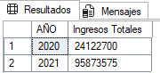
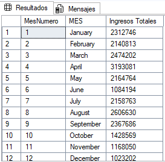
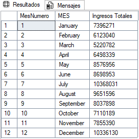

# Análisis Exploratorio de Datos (SQL)

## Preprocesamiento de Datos

La Limpieza y Verificación de los datos es fundamental para que el resultado final sea confiable y preciso.

Conjunto de Datos:


### Análisis de Ventas

#### ¿Cuáles son los ingresos totales generados por año? (SQL)

```sql
SELECT DATENAME(YEAR, [Invoice Date]) AS 'AÑO',
	SUM([Total Sales]) AS [Ingresos Totales]
FROM dbo.Adidas_US_2
GROUP BY DATENAME(YEAR, [Invoice Date]);
```


#### ¿Cuáles son los ingresos totales generados por mes tanto para los años 2020 y 2021? (SQL)

```sql
-- Ingresos totales por mes en el año 2020
SELECT 
    MONTH([Invoice Date]) AS MesNumero,
    DATENAME(MONTH, [Invoice Date]) AS 'MES',
    SUM([Total Sales]) AS [Ingresos Totales]
FROM dbo.Adidas_US_2
WHERE YEAR([Invoice Date]) = 2020
GROUP BY 
    MONTH([Invoice Date]),
    DATENAME(MONTH, [Invoice Date])
ORDER BY MesNumero;
```


```sql
-- Ingresos totales por mes en el año 2020
SELECT 
    MONTH([Invoice Date]) AS MesNumero,
    DATENAME(MONTH, [Invoice Date]) AS 'MES',
    SUM([Total Sales]) AS [Ingresos Totales]
FROM dbo.Adidas_US_2
WHERE YEAR([Invoice Date]) = 2020
GROUP BY 
    MONTH([Invoice Date]),
    DATENAME(MONTH, [Invoice Date])
ORDER BY MesNumero;
```
