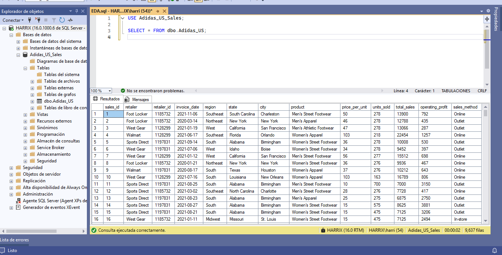
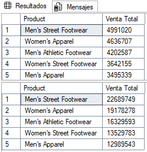
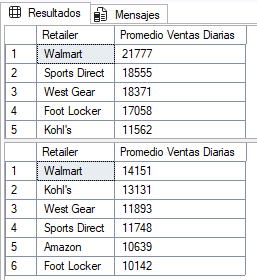
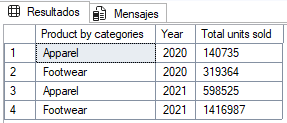
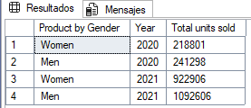
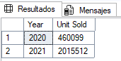

# Análisis Exploratorio de Datos (SQL)

## Preprocesamiento de Datos

La Limpieza y Verificación de los datos es fundamental para que el resultado final sea confiable y preciso.

Conjunto de Datos:



### Análisis de Ventas

#### ¿Cuáles son los ingresos totales generados por año?

```sql
SELECT DATENAME(YEAR, [Invoice Date]) AS 'AÑO',
	SUM([Total Sales]) AS [Ingresos Totales]
FROM dbo.Adidas_US_2
GROUP BY DATENAME(YEAR, [Invoice Date]);
```


#### ¿Cuáles son los ingresos totales generados por mes tanto para los años 2020 y 2021?

```sql
-- Ingresos totales por mes en el año 2020
SELECT 
    MONTH([Invoice Date]) AS MesNumero,
    DATENAME(MONTH, [Invoice Date]) AS 'MES',
    SUM([Total Sales]) AS [Ingresos Totales]
FROM dbo.Adidas_US_2
WHERE YEAR([Invoice Date]) = 2020
GROUP BY 
    MONTH([Invoice Date]),
    DATENAME(MONTH, [Invoice Date])
ORDER BY MesNumero;
```


```sql
-- Ingresos totales por mes en el año 2020
SELECT 
    MONTH([Invoice Date]) AS MesNumero,
    DATENAME(MONTH, [Invoice Date]) AS 'MES',
    SUM([Total Sales]) AS [Ingresos Totales]
FROM dbo.Adidas_US_2
WHERE YEAR([Invoice Date]) = 2020
GROUP BY 
    MONTH([Invoice Date]),
    DATENAME(MONTH, [Invoice Date])
ORDER BY MesNumero;
```


#### ¿Cuáles son los 5 mejores productos a lo largo de los años?

```sql
-- 5 mejores productos del año 2020
SELECT TOP 5 [Product],
    SUM([Total Sales]) AS [Venta Total]
FROM dbo.Adidas_US_2
WHERE DATENAME(YEAR, [Invoice Date]) = 2020
GROUP BY [Product]
ORDER BY SUM([Total Sales]) DESC
-- 5 mejpres productos del año 2021
SELECT TOP 5 [Product],
    SUM([Total Sales]) AS [Venta Total]
FROM dbo.Adidas_US_2
WHERE DATENAME(YEAR, [Invoice Date]) = 2021
GROUP BY [Product]
ORDER BY SUM([Total Sales]) DESC;
```


#### ¿Cuál es el valor promedio de ventas diarias por minorista?

```sql
-- Promedio de ventas Diarias en el 2020
SELECT [Retailer],
    AVG([Total Sales]) AS [Promedio Ventas Diarias]
FROM dbo.Adidas_US_2
WHERE DATENAME(YEAR, [Invoice Date]) = 2020
GROUP BY [Retailer]
ORDER BY AVG([Total Sales]) DESC
-- Promedio de ventas Diarias en el 2021
SELECT [Retailer],
    AVG([Total Sales]) AS [Promedio Ventas Diarias]
FROM dbo.Adidas_US_2
WHERE DATENAME(YEAR, [Invoice Date]) = 2021
GROUP BY [Retailer]
ORDER BY AVG([Total Sales]) DESC;
```


### Análisis del Cliente

#### ¿Cuáles son las principales regiones, estados y ciudades en términos de ventas?

```sql
-- Principales Regiones, Estados y Ciudades en terminos de ventas en el 2020

-- Region
SELECT 
    TOP 1 [Region],
    SUM([Total Sales]) AS [Venta Total]
FROM 
    dbo.Adidas_US_2
WHERE 
    DATENAME(YEAR, [Invoice Date]) = 2020
GROUP BY 
    [Region]
ORDER BY
    SUM([Total Sales]) DESC

-- Estado
SELECT
    TOP 1 [State],
    SUM([Total Sales]) AS [Venta Total]
FROM
    dbo.Adidas_US_2
WHERE
    DATENAME(YEAR, [Invoice Date]) = 2020
GROUP BY
    [State]
ORDER BY
    SUM([Total Sales]) DESC

-- Ciudad
SELECT
    TOP 1 [City],
    SUM([Total Sales]) AS [Venta Total]
FROM
    dbo.Adidas_US_2
WHERE
    DATENAME(YEAR, [Invoice Date]) = 2020
GROUP BY
    [City]
ORDER BY
    SUM([Total Sales]) DESC;
```


```sql
-- Principales Regiones, Estados y Ciudades en terminos de ventas en el 2021

-- Region
SELECT
    TOP 1 [Region],
    SUM([Total Sales]) AS [Venta Total]
FROM
    dbo.Adidas_US_2
WHERE
    DATENAME(YEAR, [Invoice Date]) = 2021
GROUP BY
    [Region]
ORDER BY
    SUM([Total Sales]) DESC

-- Estado
SELECT
    TOP 1 [State],
    SUM([Total Sales]) AS [Venta Total]
FROM
    dbo.Adidas_US_2
WHERE
    DATENAME(YEAR, [Invoice Date]) = 2021
GROUP BY
    [State]
ORDER BY
    SUM([Total Sales])

-- Ciudad
SELECT
    TOP 1 [City],
    SUM([Total Sales]) AS [Venta Total]
FROM
    dbo.Adidas_US_2
WHERE
    DATENAME(YEAR, [Invoice Date]) = 2021
GROUP BY
    [City]
ORDER BY
    SUM([Total Sales]) DESC;
```


#### ¿Cuáles son los 3 mejores métodos de venta?

```sql
-- TOP 3 Mejores métodos de venta en el 2020
SELECT TOP 3 [Sales Method],
    SUM([Total Sales]) AS [Venta Total]
FROM dbo.Adidas_US_2
WHERE DATENAME(YEAR, [Invoice Date]) = 2020
GROUP BY
    [Sales Method]
ORDER BY
    SUM([Total Sales]) DESC

-- TOP 3 Mejores métodos de venta en el 2021
SELECT TOP 3 [Sales Method],
    SUM([Total Sales]) AS [Venta Total]
FROM dbo.Adidas_US_2
WHERE DATENAME(YEAR, [Invoice Date]) = 2021
GROUP BY 
    [Sales Method]
ORDER BY
    SUM([Total Sales]) DESC;
```


### Análisis de Producto

#### ¿Qué categorías de productos son las más populares (ropa/calzado)?

```sql
-- 2020 & 2021

SELECT
    [Product by categories],
    [Year],
    SUM([Units Sold]) AS [Total units sold]
FROM (
    SELECT
        CASE
            WHEN [Product] LIKE '%Apparel' THEN 'Apparel'
            WHEN [Product] LIKE '%Footwear' THEN 'Footwear'
        END AS [Product by categories],
        DATENAME(YEAR, [Invoice Date]) AS [Year],
        [Units Sold]
    FROM dbo.Adidas_US_2
) AS subquery
GROUP BY
    [Product by categories],
    [Year]
ORDER BY
    [Year];
```


#### ¿Es más popular el producto para hombres o para mujeres?

```sql
-- 2020 & 2021
SELECT
    [Product by Gender],
    [Year],
    SUM([Units Sold]) AS [Total units sold]
FROM (
    SELECT
        CASE
            WHEN [Product] LIKE 'Men%' THEN 'Men'
            WHEN [Product] LIKE 'Women%' THEN 'Women'
        END AS [Product by Gender],
        DATENAME(YEAR, [Invoice Date]) AS [Year],
        [Units Sold]
    FROM dbo.Adidas_US_2
) AS subquery

GROUP BY
    [Product by Gender],
    [Year]
ORDER BY
    [Year];
```


#### ¿Cual es el total de productos vendidos anualmente?

```sql
SELECT
    DATENAME(YEAR, [Invoice Date]) AS [Year], 
    SUM([Units Sold]) AS [Unit Sold]
FROM dbo.Adidas_US_2
GROUP BY
    DATENAME(YEAR, [Invoice Date])
ORDER BY
    DATENAME(YEAR, [Invoice Date]);
```
